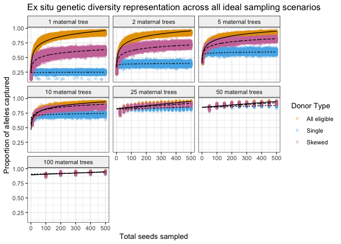

``` r
#Load libraries required for the whole script
#library(rstanarm)
#options(mc.cores = parallel::detectCores())
library(dplyr)
```

    ## 
    ## Attaching package: 'dplyr'

    ## The following objects are masked from 'package:stats':
    ## 
    ##     filter, lag

    ## The following objects are masked from 'package:base':
    ## 
    ##     intersect, setdiff, setequal, union

``` r
library(tidyr)
library(ggplot2)
theme_set(theme_bw())

#Load in data 
#load("Rdata/tidy_df_ideal.Rdata")
#Two pop data:
load("Rdata/tidy_df_ideal_twopop.Rdata")
```

``` r
#Converting these to numeric--they already should be, but they must have been converted accidentally when making the matrix a dataframe, etc...
tidy_df$prop_capt = as.numeric(tidy_df$prop_capt)
tidy_df$total_seeds = as.numeric(tidy_df$total_seeds)
tidy_df$maternal_trees = as.numeric(tidy_df$maternal_trees)

#Subset the data by maternal tree to run two separate models 
sub_1 = tidy_df %>% subset(maternal_trees < 25)
sub_2 = tidy_df %>% subset(maternal_trees >= 25)

#Running the models
model_1 = lm(prop_capt ~ log(total_seeds) * log(maternal_trees) * donor_type, data = sub_1)
model_2 = lm(prop_capt ~ total_seeds * maternal_trees * donor_type, data = sub_2)
#Save the model since it takes so long to run
#save(transformed_model, file = "transformed_model.Rdata")
#Load the model from previously saved run
#load("transformed_model.Rdata")
#Model summary! 
#summary(transformed_model, digits = 4)
```

``` r
#Creating a new dataframe of values to base predictions on 
newd_1 = data.frame(maternal_trees=(rep(c(1,2,5,10), each=1500)), total_seeds=rep(seq(1,500,1),12), donor_type=factor(rep((rep(c("all_eligible", "all_same", "skewed"), each=500)), 4)))
#Predictions 
pmu_1 = predict(model_1, re.form=NA, transform = TRUE, newdata=newd_1)

newd_2 = data.frame(maternal_trees=(rep(c(25,50,100), each=1500)), total_seeds=rep(seq(1,500,1),9), donor_type=factor(rep((rep(c("all_eligible", "all_same", "skewed"), each=500)), 3)))
#Predictions 
pmu_2 = predict(model_2, re.form=NA, transform = TRUE, newdata=newd_2)

#Creating a dataframe to plot in ggplot 
preds_1 <- cbind(newd_1, pmu_1)
colnames(preds_1) = c("maternal_trees", "total_seeds", "donor_type", "pmu")
preds_2 <- cbind(newd_2, pmu_2)
colnames(preds_2) = c("maternal_trees", "total_seeds", "donor_type", "pmu")
preds = rbind(preds_1, preds_2)

#defining a color palette to use for the plots (color-blind accessible)
cbPalette <- c("#E69F00", "#56B4E9", "#CC79A7")

#defining more descriptive labels for the facets 
mat_tree_labs = c("1 maternal tree", "2 maternal trees", "5 maternal trees", "10 maternal trees", "25 maternal trees", "50 maternal trees", "100 maternal trees")
names(mat_tree_labs) = c("1", "2", "5", "10", "25", "50", "100") 

#Plotting the data
ggplot(data=preds) +
    geom_point(data = tidy_df, aes(x=as.numeric(total_seeds*2), y=as.numeric(prop_capt), color=donor_type), alpha=0.25) +
    facet_wrap(vars(maternal_trees), labeller = labeller(maternal_trees = mat_tree_labs)) +
    geom_line(data=preds, mapping = aes(x=(total_seeds*2), y=pmu, lty=donor_type), show.legend=F) +
    ggtitle("Genetic diversity capture across all ideal sampling scenarios") +
    ylab("Proportion of alleles captured") +
    xlab("Total seeds sampled") +
    scale_colour_manual(values=cbPalette, labels = c("All eligible", "Single", "Skewed")) + 
    theme(strip.background = element_rect(color="black", fill="#F2F2F2", linetype="solid")) +
    labs(color = "Donor Type")
```

<!-- -->
