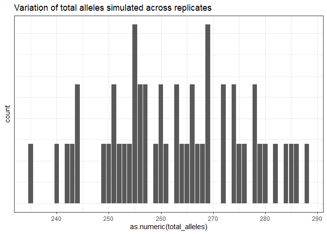
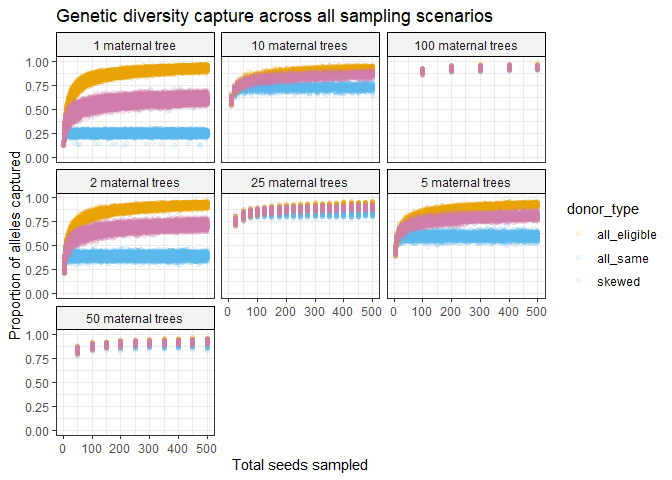
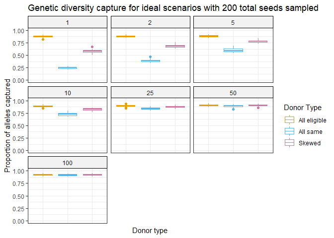
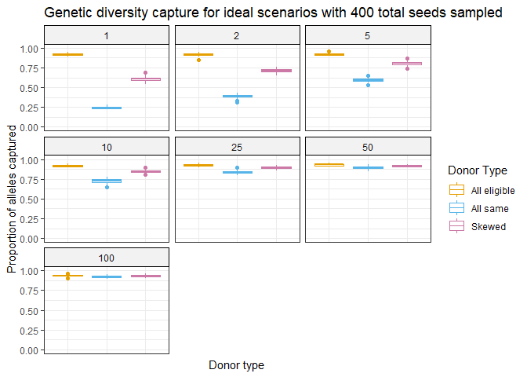
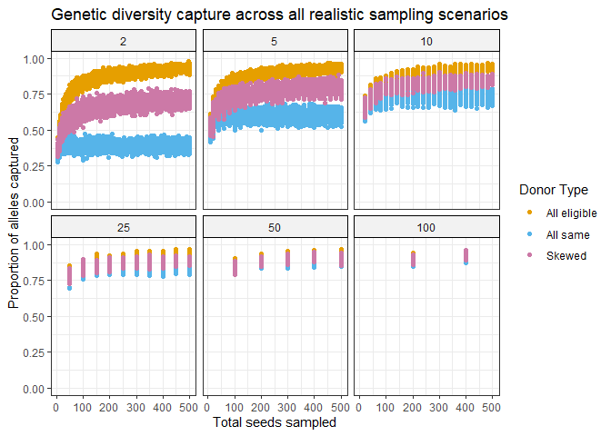
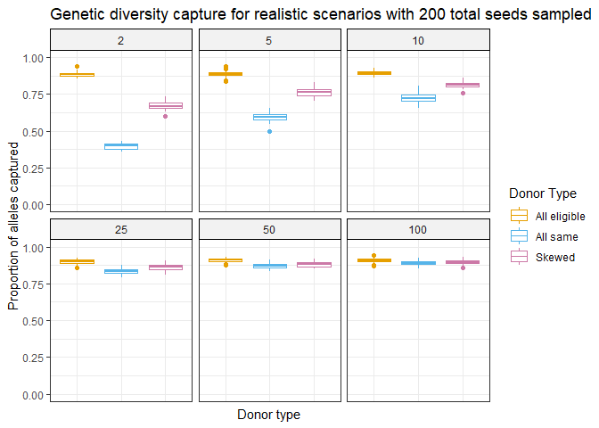
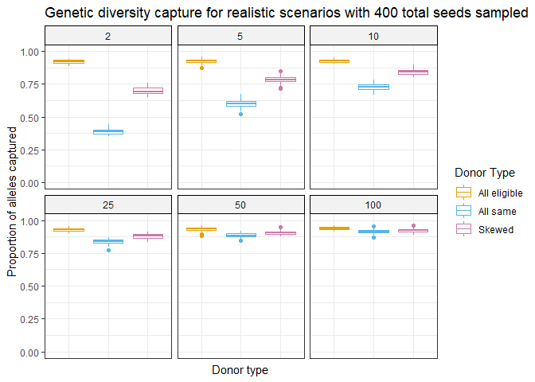
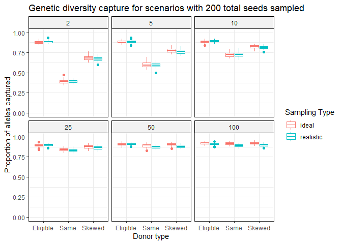

# Figures

This script is used to create figures of the raw data. **Data was
pre-processed to tidy format in the script data\_prep.Rmd**

``` r
#Load libraries 
library(dplyr)
```

    ## Warning: package 'dplyr' was built under R version 4.0.5

    ## Warning: replacing previous import 'lifecycle::last_warnings' by
    ## 'rlang::last_warnings' when loading 'pillar'

    ## Warning: replacing previous import 'lifecycle::last_warnings' by
    ## 'rlang::last_warnings' when loading 'tibble'

    ## 
    ## Attaching package: 'dplyr'

    ## The following objects are masked from 'package:stats':
    ## 
    ##     filter, lag

    ## The following objects are masked from 'package:base':
    ## 
    ##     intersect, setdiff, setequal, union

``` r
library(tidyr)
```

    ## Warning: package 'tidyr' was built under R version 4.0.5

``` r
library(ggplot2)
```

    ## Warning: package 'ggplot2' was built under R version 4.0.5

``` r
theme_set(theme_bw())

#Load in data 
load("tidy_df.Rdata")
#Making sure the data is in the correct format
tidy_df$prop_capt = as.numeric(tidy_df$prop_capt)
tidy_df$total_seeds = as.numeric(tidy_df$total_seeds)
tidy_df$maternal_trees = as.numeric(tidy_df$maternal_trees)
```

Histogram of total alleles simulated for all simulation replicates to
get an idea of the variation across replicates

``` r
ggplot(tidy_df, aes(x=as.numeric(total_alleles))) +
    geom_bar() +
    ggtitle("Variation of total alleles simulated across replicates") +
    theme(axis.text.y=element_blank(),
          axis.ticks.y=element_blank())
```

<!-- -->

**Ideal Scenarios**

Scatter plot of all raw data obtained from resampling. Plots are faceted
by maternal trees, and each color line represents a different pollen
donor type.

``` r
#defining a color palette to use for the plots (color-blind accessible)
cbPalette <- c("#E69F00", "#56B4E9", "#CC79A7")

#defining more descriptive labels for the facets 
mat_tree_labs = c("1 maternal tree", "2 maternal trees", "5 maternal trees", "10 maternal trees", "25 maternal trees", "50 maternal trees", "100 maternal trees")
names(mat_tree_labs) = c("1", "2", "5", "10", "25", "50", "100")

tidy_df %>% 
    ggplot(aes(x=as.numeric(total_seeds), y=as.numeric(prop_capt), color=donor_type)) +
    geom_point() +
    facet_wrap(vars(as.numeric(maternal_trees)), labeller = labeller(maternal_trees = mat_tree_labs)) +
    theme(strip.background = element_rect(color="black", fill="#F2F2F2", linetype="solid")) +
    ylim(0,1) + 
    ggtitle("Genetic diversity capture across all ideal sampling scenarios") +
    ylab("Proportion of alleles captured") + 
    xlab("Total seeds sampled") + 
    scale_colour_manual(values=cbPalette, labels = c("All eligible", "All same", "Skewed")) + 
    labs(color = "Donor Type")
```

<!-- -->

Boxplots of some key scenarios for comparison: Genetic diversity capture
for all scenarios with 200 total seeds sampled:

``` r
tidy_df %>% 
    filter(total_seeds==200) %>% 
    ggplot(aes(x=donor_type, y=as.numeric(prop_capt), color=donor_type)) +
    geom_boxplot() +
    facet_wrap(vars(as.numeric(maternal_trees)), labeller = labeller(maternal_trees = mat_tree_labs)) +
    theme(strip.background = element_rect(color="black", fill="#F2F2F2", linetype="solid")) +
    ylim(0,1) + 
    ggtitle("Genetic diversity capture for ideal scenarios with 200 total seeds sampled") +
    xlab("Donor type") +
    ylab("Proportion of alleles captured") +
    scale_colour_manual(values=cbPalette, labels = c("All eligible", "All same", "Skewed")) +
    theme(axis.text.x=element_blank(),
          axis.ticks.x=element_blank()) + 
    labs(color = "Donor Type")
```

<!-- -->

Genetic diversity capture for all scenarios with 400 total seeds
sampled:

``` r
tidy_df %>% 
    filter(total_seeds==400) %>% 
    ggplot(aes(x=donor_type, y=as.numeric(prop_capt), color=donor_type)) +
    geom_boxplot() +
    facet_wrap(vars(as.numeric(maternal_trees)), labeller = labeller(maternal_trees = mat_tree_labs)) +
    theme(strip.background = element_rect(color="black", fill="#F2F2F2", linetype="solid")) +
    ylim(0,1) + 
    ggtitle("Genetic diversity capture for ideal scenarios with 400 total seeds sampled") +
    xlab("Donor type") +
    ylab("Proportion of alleles captured") +
    scale_colour_manual(values=cbPalette, labels = c("All eligible", "All same", "Skewed")) +
    theme(axis.text.x=element_blank(),
          axis.ticks.x=element_blank()) + 
    labs(color = "Donor Type")
```

<!-- --> \*\*\*

**Realistic Scenarios**

``` r
#Load in data
load("tidy_df_realistic.Rdata")
tidy_df_realistic = tidy_df
#Making sure the data is in the correct format
tidy_df_realistic$prop_capt = as.numeric(tidy_df$prop_capt)
tidy_df_realistic$total_seeds = as.numeric(tidy_df$total_seeds)
tidy_df_realistic$maternal_trees = as.numeric(tidy_df$maternal_trees)
```

Plot all data together

``` r
#defining a color palette to use for the plots (color-blind accessible)
cbPalette <- c("#E69F00", "#56B4E9", "#CC79A7")

#defining more descriptive labels for the facets 
mat_tree_labs = c("1 maternal tree", "2 maternal trees", "5 maternal trees", "10 maternal trees", "25 maternal trees", "50 maternal trees", "100 maternal trees")
names(mat_tree_labs) = c("1", "2", "5", "10", "25", "50", "100")

tidy_df_realistic %>% 
    ggplot(aes(x=as.numeric(total_seeds), y=as.numeric(prop_capt), color=donor_type)) +
    geom_point() +
    facet_wrap(vars(as.numeric(maternal_trees)), labeller = labeller(maternal_trees = mat_tree_labs)) +
    theme(strip.background = element_rect(color="black", fill="#F2F2F2", linetype="solid")) +
    ylim(0,1) + 
    ggtitle("Genetic diversity capture across all realistic sampling scenarios") +
    ylab("Proportion of alleles captured") + 
    xlab("Total seeds sampled") + 
    scale_colour_manual(values=cbPalette, labels = c("All eligible", "All same", "Skewed")) + 
    labs(color = "Donor Type")
```

<!-- -->

Boxplots of scenarios with 200 seeds sampled total for comparison

``` r
tidy_df_realistic %>% 
    filter(total_seeds==200) %>% 
    ggplot(aes(x=donor_type, y=as.numeric(prop_capt), color=donor_type)) +
    geom_boxplot() +
    facet_wrap(vars(as.numeric(maternal_trees)), labeller = labeller(maternal_trees = mat_tree_labs)) +
    theme(strip.background = element_rect(color="black", fill="#F2F2F2", linetype="solid")) +
    ylim(0,1) + 
    ggtitle("Genetic diversity capture for realistic scenarios with 200 total seeds sampled") +
    xlab("Donor type") +
    ylab("Proportion of alleles captured") +
    scale_colour_manual(values=cbPalette, labels = c("All eligible", "All same", "Skewed")) +
    theme(axis.text.x=element_blank(),
          axis.ticks.x=element_blank()) + 
    labs(color = "Donor Type")
```

<!-- -->

400 seeds sampled total

``` r
tidy_df_realistic %>% 
    filter(total_seeds==400) %>% 
    ggplot(aes(x=donor_type, y=as.numeric(prop_capt), color=donor_type)) +
    geom_boxplot() +
    facet_wrap(vars(as.numeric(maternal_trees)), labeller = labeller(maternal_trees = mat_tree_labs)) +
    theme(strip.background = element_rect(color="black", fill="#F2F2F2", linetype="solid")) +
    ylim(0,1) + 
    ggtitle("Genetic diversity capture for realistic scenarios with 400 total seeds sampled") +
    xlab("Donor type") +
    ylab("Proportion of alleles captured") +
    scale_colour_manual(values=cbPalette, labels = c("All eligible", "All same", "Skewed")) +
    theme(axis.text.x=element_blank(),
          axis.ticks.x=element_blank()) + 
    labs(color = "Donor Type")
```

<!-- -->

-----

**Comparing ideal and realistic scenarios directly**

``` r
load("tidy_df.Rdata")
#Making sure the data is in the correct format
tidy_df$prop_capt = as.numeric(tidy_df$prop_capt)
tidy_df$total_seeds = as.numeric(tidy_df$total_seeds)
tidy_df$maternal_trees = as.numeric(tidy_df$maternal_trees)
#remove col to make same # cols 
tidy_df = subset(tidy_df, select = -c(seeds_per_tree))
#Create new columns to identify scenarios 
tidy_df$samp_type = "ideal"
tidy_df_realistic$samp_type = "realistic"
#Combine dataframes
combined_ideal_real = rbind(tidy_df, tidy_df_realistic)
#Make sure variables are in the correct format 
combined_ideal_real$donor_type = factor(combined_ideal_real$donor_type)
combined_ideal_real$samp_type = factor(combined_ideal_real$samp_type)
combined_ideal_real$prop_capt = as.numeric(combined_ideal_real$prop_capt)
combined_ideal_real$maternal_trees = as.numeric(combined_ideal_real$maternal_trees)
```

Plotting scenarios with 200 seeds sampled total

``` r
#defining more descriptive labels for the facets 
mat_tree_labs = c("2 maternal trees", "5 maternal trees", "10 maternal trees", "25 maternal trees", "50 maternal trees", "100 maternal trees")
names(mat_tree_labs) = c("2", "5", "10", "25", "50", "100")

#defining a color palette to use for the plots (color-blind accessible)
cbPalette <- c("#E69F00", "#f5d58e", "#56B4E9", "#96daf2", "#CC79A7", "#fcd2e9")

#Plotting the data
combined_ideal_real %>%
    filter(total_seeds==200) %>%
    filter(as.numeric(maternal_trees)>1) %>%
    ggplot() +
    geom_boxplot(aes(x=donor_type, y=as.numeric(prop_capt), color=interaction(samp_type, donor_type))) +
    facet_wrap(vars(maternal_trees), labeller = labeller(maternal_trees = mat_tree_labs)) +
    theme(strip.background = element_rect(color="black", fill="#F2F2F2", linetype="solid")) +
    ylim(0.3,1) + 
    ggtitle("Genetic diversity capture for scenarios with 200 total seeds sampled") +
    xlab("Donor type") +
    ylab("Proportion of alleles captured") +
    labs(color = "Sampling Type") +
    scale_x_discrete(labels=c("Eligible","Same","Skewed")) + 
    scale_colour_manual(values=cbPalette, labels = c("Eligible ideal", "Eligible realistic", "Same ideal", "Same realistic", "Skewed ideal", "Skewed realistic"))
```

<!-- -->
