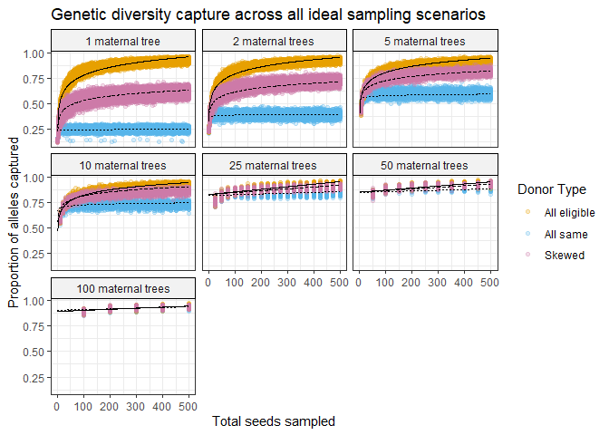

``` r
#Load libraries required for the whole script
#library(rstanarm)
#options(mc.cores = parallel::detectCores())
library(dplyr)
```

    ## 
    ## Attaching package: 'dplyr'

    ## The following objects are masked from 'package:stats':
    ## 
    ##     filter, lag

    ## The following objects are masked from 'package:base':
    ## 
    ##     intersect, setdiff, setequal, union

``` r
library(tidyr)
library(ggplot2)
theme_set(theme_bw())

source("hpdi.R")

#Load in data 
load("tidy_df.Rdata")
```

``` r
#Converting these to numeric--they already should be, but they must have been converted accidentally when making the matrix a dataframe, etc...
tidy_df$prop_capt = as.numeric(tidy_df$prop_capt)
tidy_df$total_seeds = as.numeric(tidy_df$total_seeds)
tidy_df$maternal_trees = as.numeric(tidy_df$maternal_trees)
#Running the model
transformed_model = lm(prop_capt ~ log(total_seeds) * log(maternal_trees) * donor_type, data = tidy_df) #removed weights=total_seeds
# #Save the model since it takes so long to run
save(transformed_model, file = "transformed_model.Rdata")
#Load the model from previously saved run
load("transformed_model.Rdata")
#Model summary! 
summary(transformed_model, digits = 4)
```

    ## 
    ## Call:
    ## lm(formula = prop_capt ~ log(total_seeds) * log(maternal_trees) * 
    ##     donor_type, data = tidy_df)
    ## 
    ## Residuals:
    ##       Min        1Q    Median        3Q       Max 
    ## -0.265841 -0.018967 -0.000248  0.021007  0.150021 
    ## 
    ## Coefficients:
    ##                                                           Estimate Std. Error
    ## (Intercept)                                              0.2616000  0.0010836
    ## log(total_seeds)                                         0.1126096  0.0002035
    ## log(maternal_trees)                                      0.0926990  0.0011406
    ## donor_typeall_same                                      -0.0251088  0.0015324
    ## donor_typeskewed                                        -0.0264045  0.0015324
    ## log(total_seeds):log(maternal_trees)                    -0.0159334  0.0002116
    ## log(total_seeds):donor_typeall_same                     -0.1091952  0.0002879
    ## log(total_seeds):donor_typeskewed                       -0.0470822  0.0002879
    ## log(maternal_trees):donor_typeall_same                   0.0905537  0.0016130
    ## log(maternal_trees):donor_typeskewed                     0.0489686  0.0016130
    ## log(total_seeds):log(maternal_trees):donor_typeall_same  0.0168630  0.0002993
    ## log(total_seeds):log(maternal_trees):donor_typeskewed    0.0083232  0.0002993
    ##                                                         t value Pr(>|t|)    
    ## (Intercept)                                              241.42   <2e-16 ***
    ## log(total_seeds)                                         553.24   <2e-16 ***
    ## log(maternal_trees)                                       81.27   <2e-16 ***
    ## donor_typeall_same                                       -16.39   <2e-16 ***
    ## donor_typeskewed                                         -17.23   <2e-16 ***
    ## log(total_seeds):log(maternal_trees)                     -75.29   <2e-16 ***
    ## log(total_seeds):donor_typeall_same                     -379.33   <2e-16 ***
    ## log(total_seeds):donor_typeskewed                       -163.56   <2e-16 ***
    ## log(maternal_trees):donor_typeall_same                    56.14   <2e-16 ***
    ## log(maternal_trees):donor_typeskewed                      30.36   <2e-16 ***
    ## log(total_seeds):log(maternal_trees):donor_typeall_same   56.34   <2e-16 ***
    ## log(total_seeds):log(maternal_trees):donor_typeskewed     27.81   <2e-16 ***
    ## ---
    ## Signif. codes:  0 '***' 0.001 '**' 0.01 '*' 0.05 '.' 0.1 ' ' 1
    ## 
    ## Residual standard error: 0.03483 on 140238 degrees of freedom
    ## Multiple R-squared:  0.979,  Adjusted R-squared:  0.979 
    ## F-statistic: 5.942e+05 on 11 and 140238 DF,  p-value: < 2.2e-16

``` r
#Creating a new dataframe of values to base predictions on 
newd = data.frame(maternal_trees=(rep(c(1,2,5,10,25,50,100), each=1500)), total_seeds=rep(seq(1,500,1),21), donor_type=factor(rep((rep(c("all_eligible", "all_same", "skewed"), each=500)), 7)))
#Predictions 
pmu = predict(transformed_model, re.form=NA, transform = TRUE, newdata=newd)

#Creating a dataframe to plot in ggplot 
preds <- cbind(newd, pmu)

#defining a color palette to use for the plots (color-blind accessible)
cbPalette <- c("#E69F00", "#56B4E9", "#CC79A7")

#defining more descriptive labels for the facets 
mat_tree_labs = c("1 maternal tree", "2 maternal trees", "5 maternal trees", "10 maternal trees", "25 maternal trees", "50 maternal trees", "100 maternal trees")
names(mat_tree_labs) = c("1", "2", "5", "10", "25", "50", "100") 

#Plotting the data
ggplot(data=preds) +
    geom_point(data = tidy_df, aes(x=as.numeric(total_seeds), y=as.numeric(prop_capt), color=donor_type), alpha=0.25) +
    facet_wrap(vars(maternal_trees), labeller = labeller(maternal_trees = mat_tree_labs)) +
    geom_line(data=preds, mapping = aes(x=total_seeds, y=pmu, lty=donor_type), show.legend=F) +
    ggtitle("Genetic diversity capture across all ideal sampling scenarios") +
    ylab("Proportion of alleles captured") +
    xlab("Total seeds sampled") +
    scale_colour_manual(values=cbPalette, labels = c("All eligible", "All same", "Skewed")) + 
    theme(strip.background = element_rect(color="black", fill="#F2F2F2", linetype="solid")) +
    labs(color = "Donor Type")
```

<!-- -->
